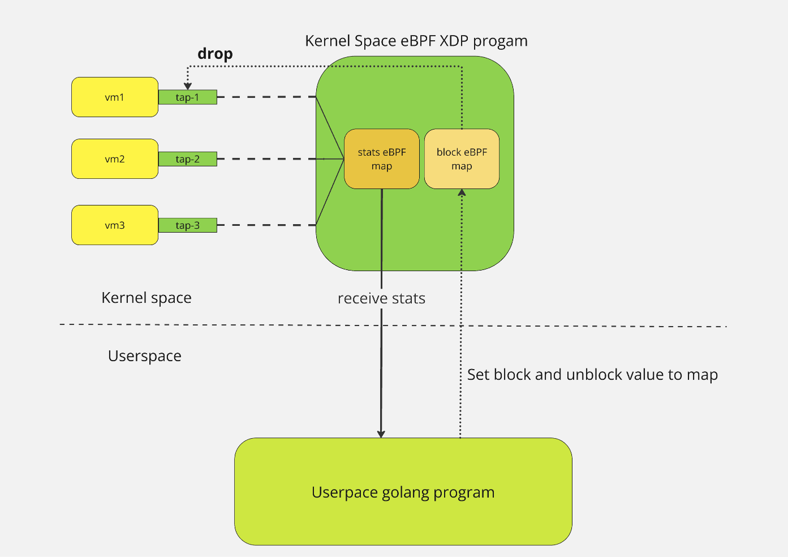

# Storm Control

## Requirements
Linux kernel version 5.7+

## Overview
This program provides two primary functionalities:
1. **Prometheus Exporter of broadcast and multicast packets**: 
    - Exports counters for broadcast and multicast packets (classified by multicast type).
2. **Storm Control Mechanism**: 
    - Controls broadcast and multicast packet rates based on configured thresholds.

Leveraging **eBPF XDP technology**, it was originally designed to monitor traffic from virtual machines in QEMU/KVM hypervisors but can also be applied to other scenarios. It can be deployed in OpenStack OVS/OVN SDN environments to monitor and block broadcast and multicast traffic based on configured thresholds. The storm control feature is optional and can be disabled if not required.

## Config and metrics

[Configuration documentation](./docs/config_options.md)

[Metrics documentation](./docs/metrics.md)

## Workflow Description
1. Initially, the program searches for interfaces to attach based on the `device_regex` or `device_list` configuration options.
2. Then, it attaches the eBPF XDP program to the identified interfaces and starts counting the packets arriving from these interfaces.
3. It counts packets for broadcast, IPv4/IPv6, and unknown multicast traffic. If the packet count exceeds the `block_threshold` configuration, the specific type of traffic (evaluated separately for each type) will be blocked on the specific interface for the duration specified by `block_delay`. Once the `block_delay` period has elapsed, the traffic is unblocked. If the `block_enabled` configuration option is set to False, the traffic will not be blocked. Instead, the program will only count packets and export counters, thus functioning primarily for observability purposes.

## Program Structure
The program consists of two main parts:
1. **Kernel Space**: Calculates and drops packets based on the configuration, storing statistics in the `intf_stats` eBPF map. Written in C and compiled with Clang, this component is embedded into the Go binary during the build process.
2. **User Space**: Developed in Go, this part manages the eBPF program and makes decisions on drop actions. It also includes a Prometheus exporter, which provides various metrics about the program state.

